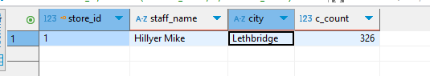
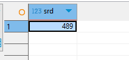
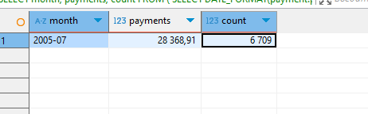

# Домашнее задание «SQL. Часть 2» - Фролов К.С.

### Задание 1

Одним запросом получите информацию о магазине, в котором обслуживается более 300 покупателей, и выведите в результат следующую информацию: 
- фамилия и имя сотрудника из этого магазина;
- город нахождения магазина;
- количество пользователей, закреплённых в этом магазине.

### Ответ

```sql
SELECT 
    store.store_id,
    CONCAT(staff.last_name, ' ', staff.first_name) AS staff_name,
    city.city,
    COUNT(customer.customer_id) AS c_count
FROM store
JOIN staff ON store.manager_staff_id = staff.staff_id
JOIN address ON store.address_id = address.address_id
JOIN city ON address.city_id = city.city_id
JOIN customer ON store.store_id = customer.store_id
GROUP BY store.store_id, staff.last_name, staff.first_name, city.city
HAVING COUNT(customer.customer_id) > 300;
```



### Задание 2

Получите количество фильмов, продолжительность которых больше средней продолжительности всех фильмов.

### Ответ

```sql
SELECT COUNT(*) AS srdfilm
FROM film
WHERE length > (SELECT AVG(length) FROM film);
```



### Задание 3

Получите информацию, за какой месяц была получена наибольшая сумма платежей, и добавьте информацию по количеству аренд за этот месяц.

### Ответ

```sql
SELECT 
    month,
    payments,
    count
FROM (
    SELECT 
        DATE_FORMAT(payment.payment_date, '%Y-%m') AS month,
        SUM(payment.amount) AS payments,
        COUNT(rental.rental_id) AS count
    FROM payment
    JOIN rental ON payment.rental_id = rental.rental_id
    GROUP BY DATE_FORMAT(payment.payment_date, '%Y-%m')
) AS stats
ORDER BY payments DESC
LIMIT 1;
```




